ingest
================
JJayes
14/11/2021

## Purpose

I found this dataset - Historical Cross-Country Technology Adoption
(HCCTA) Dataset online. It’s on the NBER website. From Diego A. Comin
and Bart Hobijin.

Here’s the
[link](https://www.nber.org/research/data/historical-cross-country-technology-adoption-hccta-dataset)

The data description [here](https://data.nber.org/hccta/hcctadhelp.pdf)

### Ingest and clean

``` r
df <- read.csv(here("data", "hcctad.txt")) %>% as_tibble() %>% janitor::clean_names()

df <- df %>% 
  mutate(across(.cols = -c(variable, year), .fns = parse_number))
```

    ## Warning: 12815 parsing failures.
    ## row col expected actual
    ##   1  -- a number      .
    ##   2  -- a number      .
    ##   3  -- a number      .
    ##   4  -- a number      .
    ##   5  -- a number      .
    ## ... ... ........ ......
    ## See problems(...) for more details.

    ## Warning: 12524 parsing failures.
    ## row col expected actual
    ##   1  -- a number      .
    ##   2  -- a number      .
    ##   3  -- a number      .
    ##   4  -- a number      .
    ##   5  -- a number      .
    ## ... ... ........ ......
    ## See problems(...) for more details.

    ## Warning: 12219 parsing failures.
    ## row col expected actual
    ##   1  -- a number      .
    ##   2  -- a number      .
    ##   3  -- a number      .
    ##   4  -- a number      .
    ##   5  -- a number      .
    ## ... ... ........ ......
    ## See problems(...) for more details.

    ## Warning: 12784 parsing failures.
    ## row col expected actual
    ##   1  -- a number      .
    ##   2  -- a number      .
    ##   3  -- a number      .
    ##   4  -- a number      .
    ##   5  -- a number      .
    ## ... ... ........ ......
    ## See problems(...) for more details.

    ## Warning: 11462 parsing failures.
    ## row col expected actual
    ##   1  -- a number      .
    ##   2  -- a number      .
    ##   3  -- a number      .
    ##   4  -- a number      .
    ##   5  -- a number      .
    ## ... ... ........ ......
    ## See problems(...) for more details.

    ## Warning: 12533 parsing failures.
    ## row col expected actual
    ##   1  -- a number      .
    ##   2  -- a number      .
    ##   3  -- a number      .
    ##   4  -- a number      .
    ##   5  -- a number      .
    ## ... ... ........ ......
    ## See problems(...) for more details.

    ## Warning: 10658 parsing failures.
    ## row col expected actual
    ##   1  -- a number      .
    ##   2  -- a number      .
    ##   3  -- a number      .
    ##   4  -- a number      .
    ##   5  -- a number      .
    ## ... ... ........ ......
    ## See problems(...) for more details.

    ## Warning: 11763 parsing failures.
    ## row col expected actual
    ##   1  -- a number      .
    ##   2  -- a number      .
    ##   3  -- a number      .
    ##   4  -- a number      .
    ##   5  -- a number      .
    ## ... ... ........ ......
    ## See problems(...) for more details.

    ## Warning: 13506 parsing failures.
    ## row col expected actual
    ##   1  -- a number      .
    ##   2  -- a number      .
    ##   3  -- a number      .
    ##   4  -- a number      .
    ##   5  -- a number      .
    ## ... ... ........ ......
    ## See problems(...) for more details.

    ## Warning: 15860 parsing failures.
    ## row col expected actual
    ##   1  -- a number      .
    ##   2  -- a number      .
    ##   3  -- a number      .
    ##   4  -- a number      .
    ##   5  -- a number      .
    ## ... ... ........ ......
    ## See problems(...) for more details.

    ## Warning: 14569 parsing failures.
    ## row col expected actual
    ##   1  -- a number      .
    ##   2  -- a number      .
    ##   3  -- a number      .
    ##   4  -- a number      .
    ##   5  -- a number      .
    ## ... ... ........ ......
    ## See problems(...) for more details.

    ## Warning: 11673 parsing failures.
    ## row col expected actual
    ##   1  -- a number      .
    ##   2  -- a number      .
    ##   3  -- a number      .
    ##   4  -- a number      .
    ##   5  -- a number      .
    ## ... ... ........ ......
    ## See problems(...) for more details.

    ## Warning: 12309 parsing failures.
    ## row col expected actual
    ##   1  -- a number      .
    ##   2  -- a number      .
    ##   3  -- a number      .
    ##   4  -- a number      .
    ##   5  -- a number      .
    ## ... ... ........ ......
    ## See problems(...) for more details.

    ## Warning: 16029 parsing failures.
    ## row col expected actual
    ##   1  -- a number      .
    ##   2  -- a number      .
    ##   3  -- a number      .
    ##   4  -- a number      .
    ##   5  -- a number      .
    ## ... ... ........ ......
    ## See problems(...) for more details.

    ## Warning: 11672 parsing failures.
    ## row col expected actual
    ##   1  -- a number      .
    ##   2  -- a number      .
    ##   3  -- a number      .
    ##   4  -- a number      .
    ##   5  -- a number      .
    ## ... ... ........ ......
    ## See problems(...) for more details.

    ## Warning: 13197 parsing failures.
    ## row col expected actual
    ##   1  -- a number      .
    ##   2  -- a number      .
    ##   3  -- a number      .
    ##   4  -- a number      .
    ##   5  -- a number      .
    ## ... ... ........ ......
    ## See problems(...) for more details.

    ## Warning: 11729 parsing failures.
    ## row col expected actual
    ##   1  -- a number      .
    ##   2  -- a number      .
    ##   3  -- a number      .
    ##   4  -- a number      .
    ##   5  -- a number      .
    ## ... ... ........ ......
    ## See problems(...) for more details.

    ## Warning: 13323 parsing failures.
    ## row col expected actual
    ##   1  -- a number      .
    ##   2  -- a number      .
    ##   3  -- a number      .
    ##   4  -- a number      .
    ##   5  -- a number      .
    ## ... ... ........ ......
    ## See problems(...) for more details.

    ## Warning: 12751 parsing failures.
    ## row col expected actual
    ##   1  -- a number      .
    ##   2  -- a number      .
    ##   3  -- a number      .
    ##   4  -- a number      .
    ##   5  -- a number      .
    ## ... ... ........ ......
    ## See problems(...) for more details.

    ## Warning: 11446 parsing failures.
    ## row col expected actual
    ##   1  -- a number      .
    ##   2  -- a number      .
    ##   3  -- a number      .
    ##   4  -- a number      .
    ##   5  -- a number      .
    ## ... ... ........ ......
    ## See problems(...) for more details.

    ## Warning: 12458 parsing failures.
    ## row col expected actual
    ##   1  -- a number      .
    ##   2  -- a number      .
    ##   3  -- a number      .
    ##   4  -- a number      .
    ##   5  -- a number      .
    ## ... ... ........ ......
    ## See problems(...) for more details.

    ## Warning: 10648 parsing failures.
    ## row col expected actual
    ##   1  -- a number      .
    ##   2  -- a number      .
    ##   3  -- a number      .
    ##   4  -- a number      .
    ##   5  -- a number      .
    ## ... ... ........ ......
    ## See problems(...) for more details.

    ## Warning: 11045 parsing failures.
    ## row col expected actual
    ##   1  -- a number      .
    ##   2  -- a number      .
    ##   3  -- a number      .
    ##   4  -- a number      .
    ##   5  -- a number      .
    ## ... ... ........ ......
    ## See problems(...) for more details.

``` r
df %>% distinct(variable)
```

    ## # A tibble: 80 x 1
    ##    variable                       
    ##    <chr>                          
    ##  1 Population                     
    ##  2 Real GDP                       
    ##  3 nominal GDP                    
    ##  4 Length of Railway line open    
    ##  5 Freight traffic on railways-1  
    ##  6 Freight traffic on railways-2  
    ##  7 Passenger traffic on railways-1
    ##  8 Passenger traffic on railways-2
    ##  9 Energy output                  
    ## 10 Phones                         
    ## # ... with 70 more rows

### Reshape

``` r
df <- df %>% 
  pivot_longer(-c(variable, year), names_to = "country", values_to = "value") %>% 
  mutate(country = str_to_title(str_replace_all(country, "_", " ")))
```

### Cleaning

``` r
# df %>% 
#   filter(country == "Germany",
#          variable == "Length of Railway line open") %>% 
#   ggplot(aes(year, value)) +
#   geom_line()

df <- df %>% 
  mutate(value = case_when(
    country == "Germany" & variable == "Length of Railway line open" & value > 4e06 ~ 0,
    TRUE ~ value))
```

### Skim

``` r
df_skim <- df %>% pivot_wider(names_from = "variable") %>% skimr::skim()
```

### What variables are complete?

``` r
df_skim %>% select(skim_variable, complete_rate) %>% 
  mutate(skim_variable = fct_reorder(skim_variable, complete_rate)) %>% 
  head(20) %>% 
  ggplot(aes(complete_rate, skim_variable, fill = complete_rate)) +
  geom_col() +
  scale_x_continuous(labels = percent_format())
```

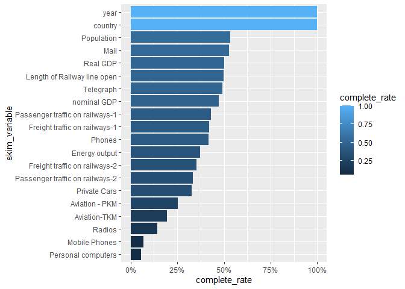<!-- -->

What kinds of variables are there?

Standard with high complete rate:

-   year
-   pop
-   real and nom. GDP

Some interesting continuous variables

-   Length of Railway line open

-   Freight traffic on railways

-   Passenger traffic on railways

-   Energy output - how is this measured?

Types of technology

-   Phones

### Modify steel

``` r
df %>% 
  filter(str_detect(variable, "steel"),
         !is.na(value)) %>% 
  mutate(country = fct_lump(country, 9)) %>% 
  filter(!country == "Other") %>% 
  mutate(country = fct_reorder(country, value, .desc = T, .fun = sum),
         variable = str_to_title(str_remove(variable, "steel - "))) %>% 
  ggplot(aes(year, value, fill = variable, group = variable)) +
  geom_area() +
  scale_y_continuous(labels = number_format()) +
  facet_wrap(~ country) +
  labs(x = NULL,
       y = "Thousands of metric tons of crude steel",
       fill = "Steel production method")
```

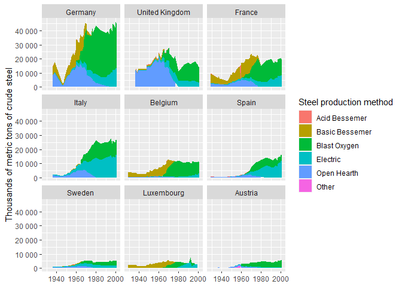<!-- -->

So the issue is that it’s great to have all these types of steel over
time. but wouldn’t it be nicer just to have a sum.

``` r
df %>% filter(str_detect(variable, "steel")) %>%
  group_by(year, country) %>% 
  mutate(steel_total = sum(value, na.rm = T)) %>% 
  ungroup() %>% 
  filter(steel_total > 0) %>% 
  ggplot(aes(year, steel_total, colour = country)) +
  geom_point() +
  geom_line()
```

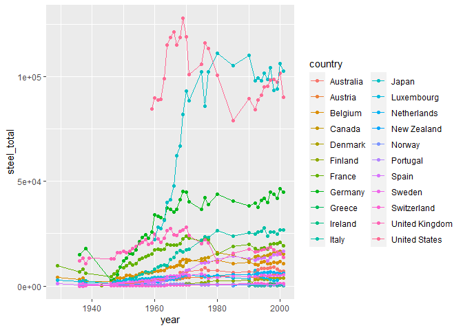<!-- -->

``` r
df_steel <- df %>% filter(str_detect(variable, "steel")) %>%
  group_by(year, country) %>% 
  mutate(steel_total = sum(value, na.rm = T)) %>% 
  ungroup() %>% 
  select(year, country, value = steel_total) %>% 
  mutate(variable = "steel total") %>% 
  filter(value > 0)

df <- df %>% 
  bind_rows(df_steel)

# df %>% write_rds(here("data", "df.rds"))
```

``` r
# df <- read_rds(here("data", "df.rds"))
```

### Data descriptions

``` r
# library(readxl)
# hccta_data_description <- read_excel("data/hccta_data_description.xlsx")
# 
# df_data_descs <- hccta_data_description %>% 
#   separate(key, into = c("variable", "description"), sep = ", ", extra = "merge")
# 
# df_data_descs <- df_data_descs %>% 
#   mutate(description = str_to_sentence(description),
#          variable = str_to_lower(variable),
#          variable = str_squish(variable),
#          variable = str_replace_all(variable, " - ", "-"))
# 
# df <- df %>% mutate(variable = str_to_lower(variable))
# 
# df %>% 
#   anti_join(df_data_descs) %>% distinct(variable)
```

### Plotting

``` r
df %>% 
  filter(variable == "Population") %>% 
  ggplot(aes(year, value, colour = country)) +
  geom_point() +
  geom_line()
```

    ## Warning: Removed 2289 rows containing missing values (geom_point).

    ## Warning: Removed 1293 row(s) containing missing values (geom_path).

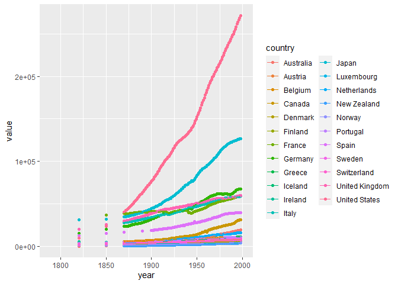<!-- -->

What about some of the other complete variables? Start with function to
plot these.

``` r
plot_variable <- function(var) {
  df %>%
    filter(variable == var,
           value > 0) %>%
    ggplot(aes(year, value, colour = country)) +
    geom_point() +
    geom_line() +
    scale_y_continuous(labels = number_format()) +
    labs(title = paste0("Evolution/adoption of ", var, " over time"),
         x = NULL,
         y = NULL)
}

plot_variable("Mail")
```

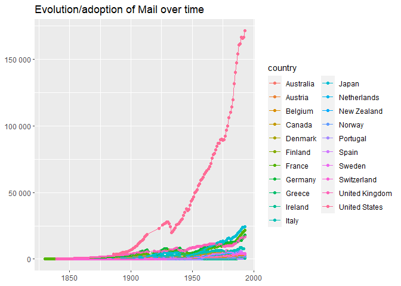<!-- -->

What does energy output look like?

``` r
plot_variable("Energy output")
```

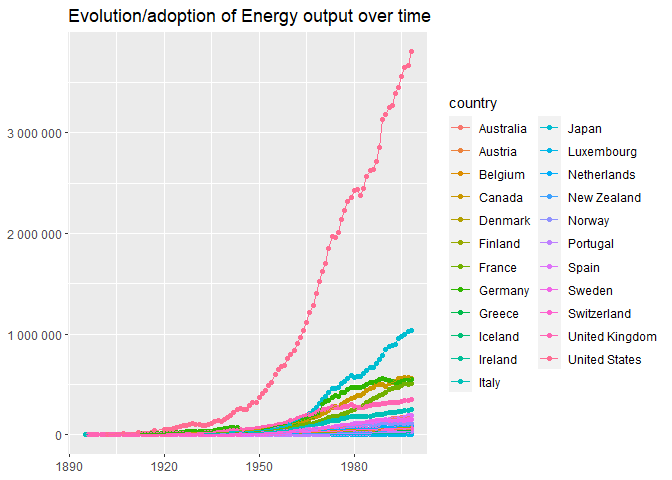<!-- -->

``` r
plot_variable("Newspapers")
```

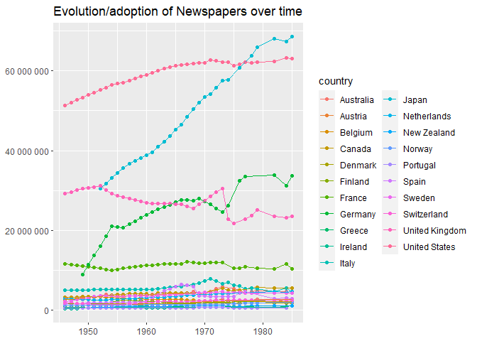<!-- -->

Railways - there seems to be a data error for Germany. Imma fix it.

``` r
plot_variable("Length of Railway line open")
```

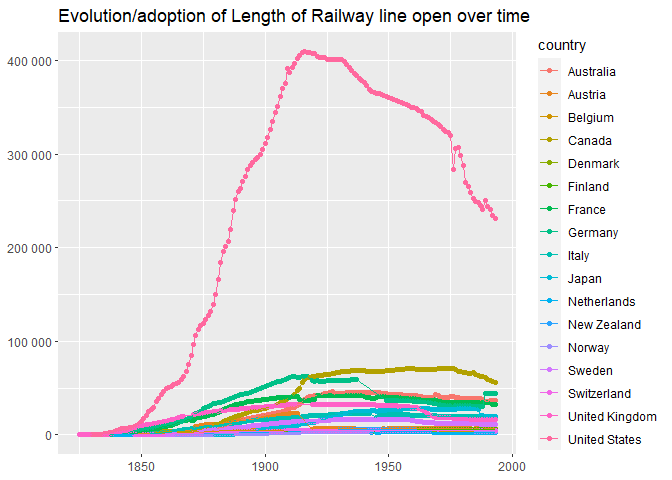<!-- -->

``` r
plot_variable("Freight traffic on railways-1")
```

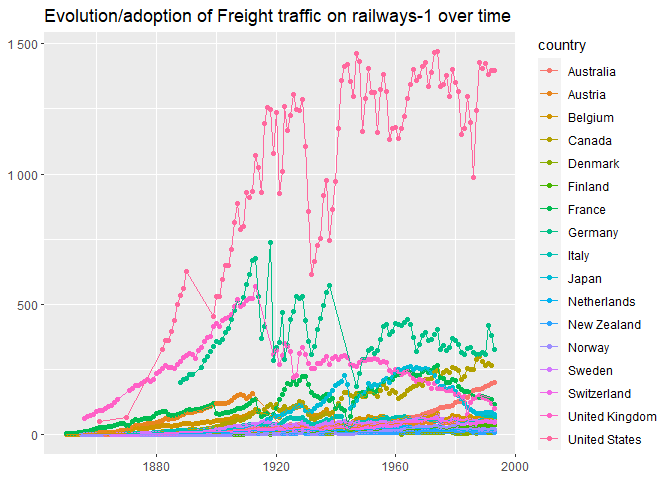<!-- -->

Wow look how Japan speeds ahead in the adoptio of industrial robots over
time

``` r
plot_variable("industrial robots")
```

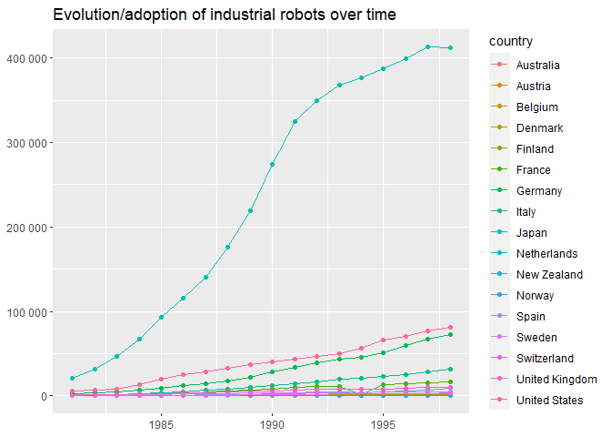<!-- -->

What about urbanization? Kinda strange - only two points - 1800 and
1850. Same as constraint on executive

``` r
plot_variable("Urbanization")
```

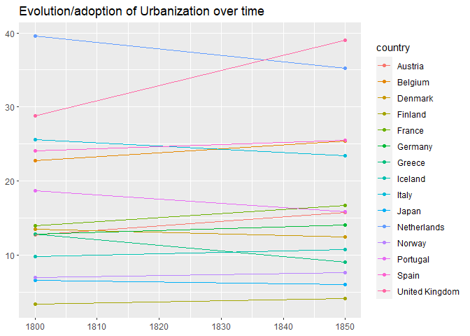<!-- -->

``` r
plot_variable("Constraint on Executive")
```

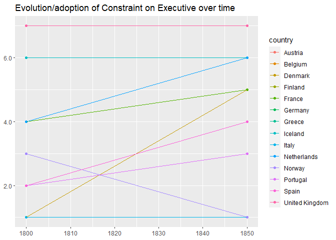<!-- -->

### Per capita plot

Maybe I should have a function to plot per person and then plot relative
to GDP per capita?

``` r
plot_variable_pc <- function(var) {
  df %>%
    filter(variable %in% c(var, "Population")) %>%
    pivot_wider(names_from = variable) %>%
    rowwise() %>%
    mutate(
      value_pc = !!sym(var) / Population,
      value_pc = replace_na(value_pc, 0)
    ) %>%
    filter(value_pc > 0) %>% 
    ggplot(aes(year, value_pc, colour = country)) +
    geom_point() +
    geom_line() +
    scale_y_continuous(labels = number_format()) +
    labs(x = NULL,
         title = paste0("Evolution/adoption of ", 
                        var, " per capita over time"),
         y = paste0(var, " per person"))
}

plot_variable_pc("Energy output")
```

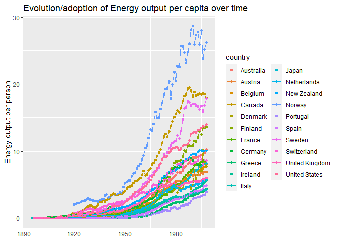<!-- -->

``` r
plot_variable_pc("Newspapers")
```

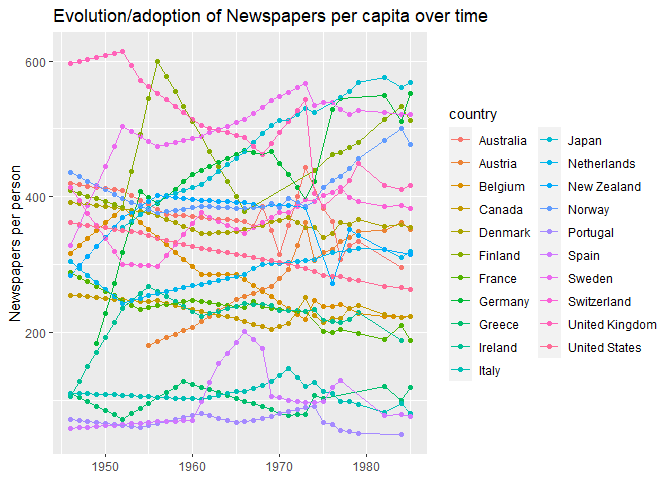<!-- -->

``` r
plot_variable_pc("Phones") +
  scale_y_continuous(labels = percent_format())
```

    ## Scale for 'y' is already present. Adding another scale for 'y', which will
    ## replace the existing scale.

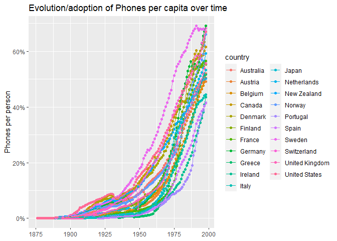<!-- -->

### gghighlight

``` r
library(gghighlight)
```

``` r
country_choices <- c("Sweden", "United Kingdom", "United States", "Spain")

plot_variable_pc("Phones") +
  gghighlight(country %in% country_choices) +
  scale_color_brewer(palette = "Dark2")
```

    ## Warning: Tried to calculate with group_by(), but the calculation failed.
    ## Falling back to ungrouped filter operation...

    ## Warning: Tried to calculate with group_by(), but the calculation failed.
    ## Falling back to ungrouped filter operation...

    ## label_key: country

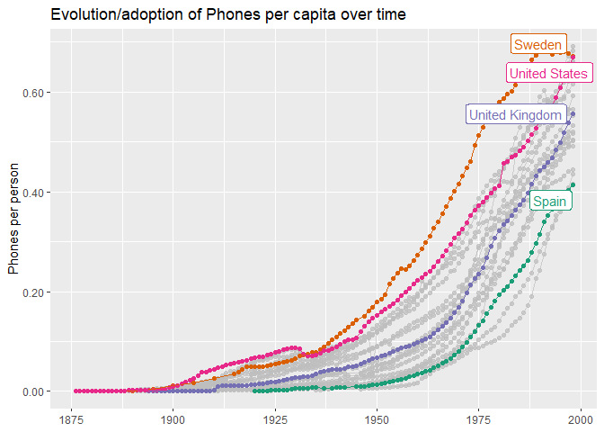<!-- -->

``` r
plot_variable_pc("Energy output") +
  gghighlight(country %in% country_choices) +
  scale_color_brewer(palette = "Dark2")
```

    ## Warning: Tried to calculate with group_by(), but the calculation failed.
    ## Falling back to ungrouped filter operation...

    ## Warning: Tried to calculate with group_by(), but the calculation failed.
    ## Falling back to ungrouped filter operation...

    ## label_key: country

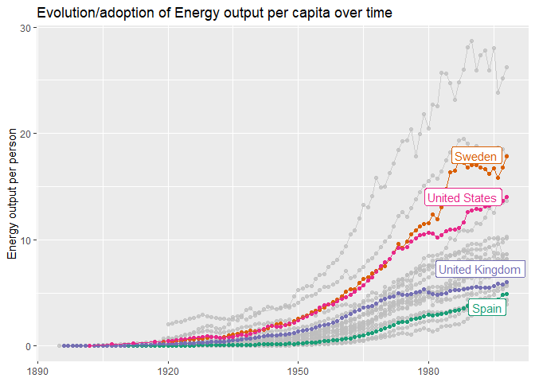<!-- -->

``` r
plot_variable_pc("Length of Railway line open") +
  gghighlight(country %in% country_choices) +
  scale_color_brewer(palette = "Dark2")
```

    ## Warning: Tried to calculate with group_by(), but the calculation failed.
    ## Falling back to ungrouped filter operation...

    ## Warning: Tried to calculate with group_by(), but the calculation failed.
    ## Falling back to ungrouped filter operation...

    ## label_key: country

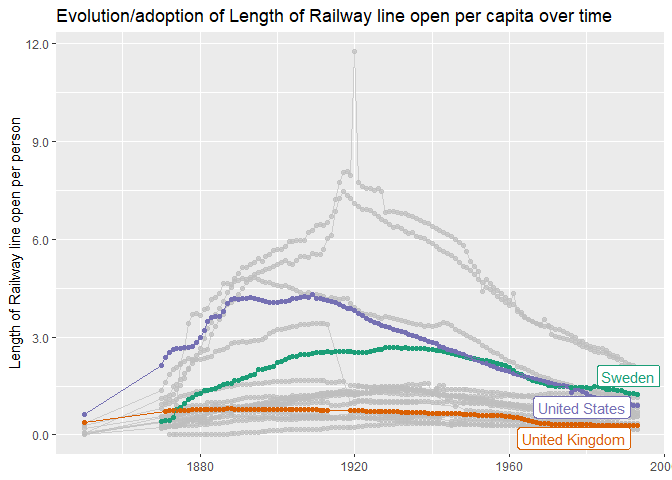<!-- -->

What does it mean that Sweden has high literacy rates from 1850, but
that primary and secondary enrolment is lower than the UK and the US??

``` r
plot_variable("Literacy rate") +
  gghighlight(country %in% country_choices) +
  scale_color_brewer(palette = "Dark2") +
  scale_y_continuous(labels = percent_format())
```

    ## Warning: Tried to calculate with group_by(), but the calculation failed.
    ## Falling back to ungrouped filter operation...

    ## Warning: Tried to calculate with group_by(), but the calculation failed.
    ## Falling back to ungrouped filter operation...

    ## label_key: country

    ## Scale for 'y' is already present. Adding another scale for 'y', which will
    ## replace the existing scale.

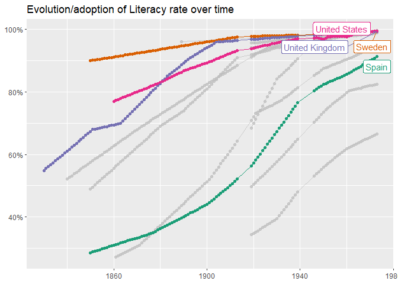<!-- -->

``` r
plot_variable("Primary Enrollment") +
  gghighlight(country %in% country_choices) +
  scale_color_brewer(palette = "Dark2") +
  scale_y_continuous(labels = percent_format())
```

    ## Warning: Tried to calculate with group_by(), but the calculation failed.
    ## Falling back to ungrouped filter operation...

    ## Warning: Tried to calculate with group_by(), but the calculation failed.
    ## Falling back to ungrouped filter operation...

    ## label_key: country
    ## Scale for 'y' is already present. Adding another scale for 'y', which will
    ## replace the existing scale.

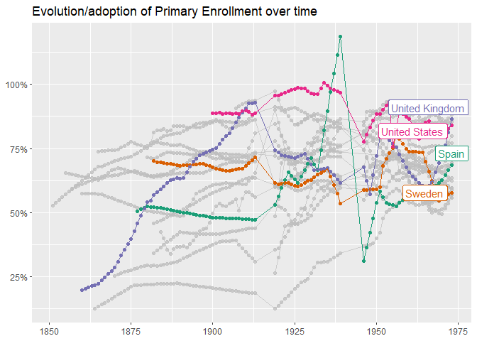<!-- -->

``` r
plot_variable("Secondary Enrollment") +
  gghighlight(country %in% country_choices) +
  scale_color_brewer(palette = "Dark2") +
  scale_y_continuous(labels = percent_format())
```

    ## Warning: Tried to calculate with group_by(), but the calculation failed.
    ## Falling back to ungrouped filter operation...

    ## Warning: Tried to calculate with group_by(), but the calculation failed.
    ## Falling back to ungrouped filter operation...

    ## label_key: country
    ## Scale for 'y' is already present. Adding another scale for 'y', which will
    ## replace the existing scale.

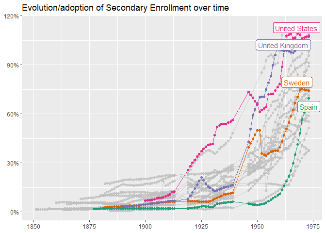<!-- -->

What about the cars?? And transport?

``` r
plot_variable_pc("Private Cars") +
  gghighlight(country %in% country_choices) +
  scale_color_brewer(palette = "Dark2")
```

    ## Warning: Tried to calculate with group_by(), but the calculation failed.
    ## Falling back to ungrouped filter operation...

    ## Warning: Tried to calculate with group_by(), but the calculation failed.
    ## Falling back to ungrouped filter operation...

    ## label_key: country

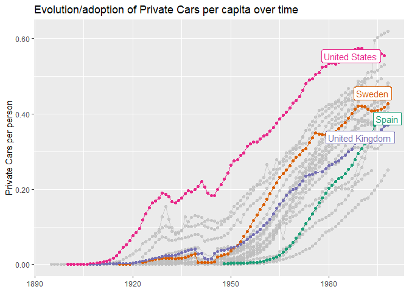<!-- -->

``` r
plot_variable_pc("Aviation - PKM") +
  gghighlight(country %in% country_choices) +
  scale_color_brewer(palette = "Dark2")
```

    ## Warning: Tried to calculate with group_by(), but the calculation failed.
    ## Falling back to ungrouped filter operation...

    ## Warning: Tried to calculate with group_by(), but the calculation failed.
    ## Falling back to ungrouped filter operation...

    ## label_key: country

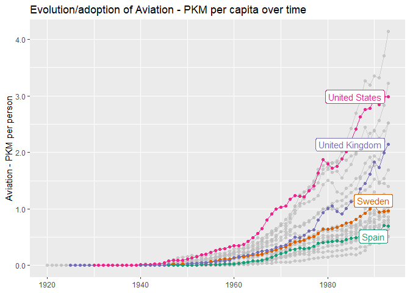<!-- -->

``` r
plot_variable_pc("Aviation-TKM")
```

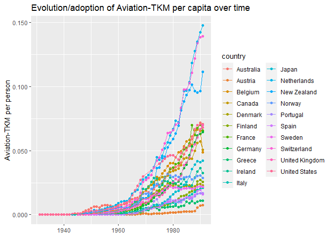<!-- -->

``` r
plot_variable("Number of Ships-All")
```

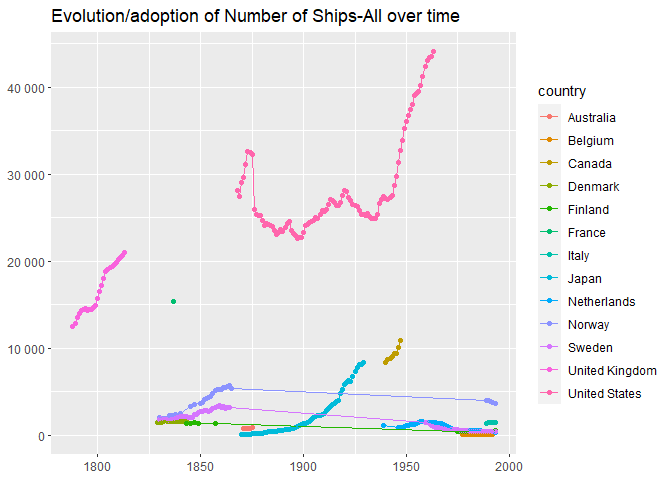<!-- -->

``` r
plot_variable("Tonnage-Motorships")
```

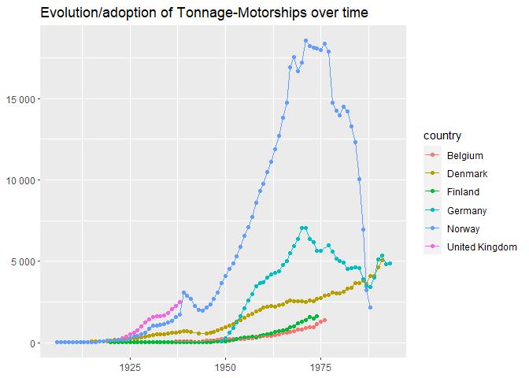<!-- -->

Could look at communication technologies?? vs industrial technologies??

``` r
plot_variable_pc("Mail") +
  gghighlight(country %in% country_choices) +
  scale_color_brewer(palette = "Dark2")
```

    ## Warning: Tried to calculate with group_by(), but the calculation failed.
    ## Falling back to ungrouped filter operation...

    ## Warning: Tried to calculate with group_by(), but the calculation failed.
    ## Falling back to ungrouped filter operation...

    ## label_key: country

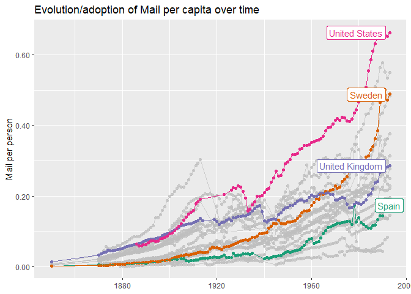<!-- -->

``` r
plot_variable_pc("Newspapers") +
  gghighlight(country %in% country_choices) +
  scale_color_brewer(palette = "Dark2")
```

    ## Warning: Tried to calculate with group_by(), but the calculation failed.
    ## Falling back to ungrouped filter operation...

    ## Warning: Tried to calculate with group_by(), but the calculation failed.
    ## Falling back to ungrouped filter operation...

    ## label_key: country

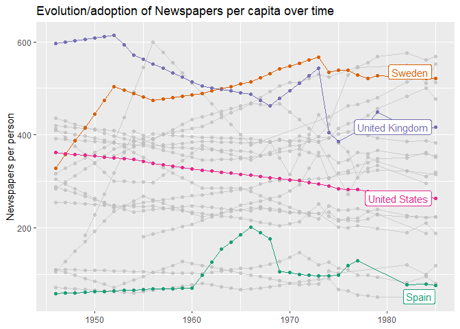<!-- -->

``` r
plot_variable_pc("Phones") +
  gghighlight(country %in% country_choices) +
  scale_color_brewer(palette = "Dark2")
```

    ## Warning: Tried to calculate with group_by(), but the calculation failed.
    ## Falling back to ungrouped filter operation...

    ## Warning: Tried to calculate with group_by(), but the calculation failed.
    ## Falling back to ungrouped filter operation...

    ## label_key: country

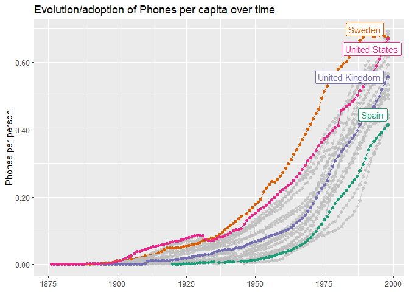<!-- -->

``` r
plot_variable_pc("Personal computers") +
  gghighlight(country %in% country_choices) +
  scale_color_brewer(palette = "Dark2")
```

    ## Warning: Tried to calculate with group_by(), but the calculation failed.
    ## Falling back to ungrouped filter operation...

    ## Warning: Tried to calculate with group_by(), but the calculation failed.
    ## Falling back to ungrouped filter operation...

    ## label_key: country

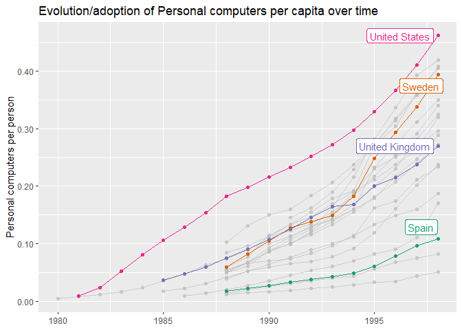<!-- -->

``` r
plot_variable_pc("Televisions") +
  gghighlight(country %in% country_choices) +
  scale_color_brewer(palette = "Dark2")
```

    ## Warning: Tried to calculate with group_by(), but the calculation failed.
    ## Falling back to ungrouped filter operation...

    ## Warning: Tried to calculate with group_by(), but the calculation failed.
    ## Falling back to ungrouped filter operation...

    ## label_key: country

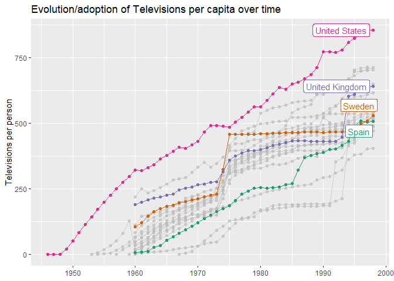<!-- -->

Need to do a GDP plot I think. Gonna try the one with the colour of the
dots for time.

``` r
# df %>% 
#   filter(vaiable %in% c(""))
```

### Plotting trade

``` r
plot_variable_pc("Trade - Total")
```

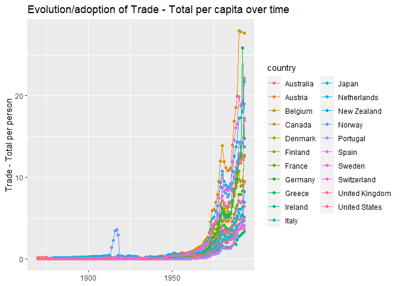<!-- -->

``` r
df %>%
  filter(
    variable %in% c("Real GDP", "Imports - 1", "Exports - 1"),
    value > 0
  ) %>%
  mutate(value = case_when(
    variable != "Real GDP" ~ value / 1000,
    TRUE ~ value * 1/100
  )) %>% 
  ggplot(aes(year, value, colour = country)) +
  geom_point() +
  geom_line() +
  facet_wrap(~variable) +
  scale_y_continuous(labels = number_format()) +
  labs(
    # title = paste0("Evolution/adoption of ", var, " over time"),
    x = NULL,
    y = NULL
  )
```

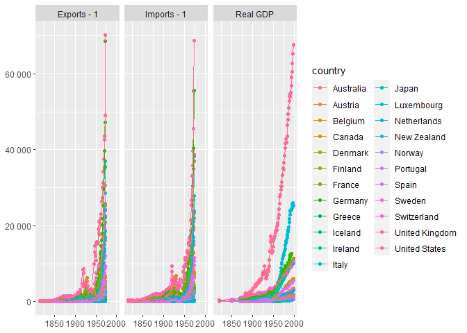<!-- -->

### Trade for sweden

``` r
df %>% 
  filter(country == "Sweden",
         str_detect(variable, "trade"),
         !str_detect(variable, "sweden"),
         value > 0) %>% 
  mutate(variable = str_remove_all(variable, "trade - "),
         variable = str_to_title(variable),
         time_chunk = year - year %% 3) %>% 
  group_by(time_chunk, variable) %>% 
  mutate(value = mean(value, na.rm = T)) %>% 
  ungroup() %>%
  ggplot(aes(time_chunk, value, colour = variable)) +
  geom_line() +
  geom_point() +
  # scale_y_log10() +
  gghighlight(str_detect(variable, c("Germany", "France", "Denmark", "Spain")))
```

    ## Warning in stri_detect_regex(string, pattern, negate = negate, opts_regex =
    ## opts(pattern)): longer object length is not a multiple of shorter object length

    ## Warning in stri_detect_regex(string, pattern, negate = negate, opts_regex =
    ## opts(pattern)): longer object length is not a multiple of shorter object length

    ## Warning in stri_detect_regex(string, pattern, negate = negate, opts_regex =
    ## opts(pattern)): longer object length is not a multiple of shorter object length

    ## Warning in stri_detect_regex(string, pattern, negate = negate, opts_regex =
    ## opts(pattern)): longer object length is not a multiple of shorter object length

    ## Warning in stri_detect_regex(string, pattern, negate = negate, opts_regex =
    ## opts(pattern)): longer object length is not a multiple of shorter object length

    ## Warning in stri_detect_regex(string, pattern, negate = negate, opts_regex =
    ## opts(pattern)): longer object length is not a multiple of shorter object length

    ## Warning in stri_detect_regex(string, pattern, negate = negate, opts_regex =
    ## opts(pattern)): longer object length is not a multiple of shorter object length

    ## Warning in stri_detect_regex(string, pattern, negate = negate, opts_regex =
    ## opts(pattern)): longer object length is not a multiple of shorter object length

    ## Warning in stri_detect_regex(string, pattern, negate = negate, opts_regex =
    ## opts(pattern)): longer object length is not a multiple of shorter object length

    ## Warning in stri_detect_regex(string, pattern, negate = negate, opts_regex =
    ## opts(pattern)): longer object length is not a multiple of shorter object length

    ## Warning in stri_detect_regex(string, pattern, negate = negate, opts_regex =
    ## opts(pattern)): longer object length is not a multiple of shorter object length

    ## Warning in stri_detect_regex(string, pattern, negate = negate, opts_regex =
    ## opts(pattern)): longer object length is not a multiple of shorter object length

    ## Warning in stri_detect_regex(string, pattern, negate = negate, opts_regex =
    ## opts(pattern)): longer object length is not a multiple of shorter object length

    ## Warning in stri_detect_regex(string, pattern, negate = negate, opts_regex =
    ## opts(pattern)): longer object length is not a multiple of shorter object length

    ## Warning: Tried to calculate with group_by(), but the calculation failed.
    ## Falling back to ungrouped filter operation...

    ## Warning in stri_detect_regex(string, pattern, negate = negate, opts_regex =
    ## opts(pattern)): longer object length is not a multiple of shorter object length

    ## Warning in stri_detect_regex(string, pattern, negate = negate, opts_regex =
    ## opts(pattern)): longer object length is not a multiple of shorter object length

    ## Warning in stri_detect_regex(string, pattern, negate = negate, opts_regex =
    ## opts(pattern)): longer object length is not a multiple of shorter object length

    ## Warning in stri_detect_regex(string, pattern, negate = negate, opts_regex =
    ## opts(pattern)): longer object length is not a multiple of shorter object length

    ## Warning in stri_detect_regex(string, pattern, negate = negate, opts_regex =
    ## opts(pattern)): longer object length is not a multiple of shorter object length

    ## Warning in stri_detect_regex(string, pattern, negate = negate, opts_regex =
    ## opts(pattern)): longer object length is not a multiple of shorter object length

    ## Warning in stri_detect_regex(string, pattern, negate = negate, opts_regex =
    ## opts(pattern)): longer object length is not a multiple of shorter object length

    ## Warning in stri_detect_regex(string, pattern, negate = negate, opts_regex =
    ## opts(pattern)): longer object length is not a multiple of shorter object length

    ## Warning in stri_detect_regex(string, pattern, negate = negate, opts_regex =
    ## opts(pattern)): longer object length is not a multiple of shorter object length

    ## Warning in stri_detect_regex(string, pattern, negate = negate, opts_regex =
    ## opts(pattern)): longer object length is not a multiple of shorter object length

    ## Warning in stri_detect_regex(string, pattern, negate = negate, opts_regex =
    ## opts(pattern)): longer object length is not a multiple of shorter object length

    ## Warning in stri_detect_regex(string, pattern, negate = negate, opts_regex =
    ## opts(pattern)): longer object length is not a multiple of shorter object length

    ## Warning in stri_detect_regex(string, pattern, negate = negate, opts_regex =
    ## opts(pattern)): longer object length is not a multiple of shorter object length

    ## Warning in stri_detect_regex(string, pattern, negate = negate, opts_regex =
    ## opts(pattern)): longer object length is not a multiple of shorter object length

    ## Warning in stri_detect_regex(string, pattern, negate = negate, opts_regex =
    ## opts(pattern)): longer object length is not a multiple of shorter object length

    ## Warning: Tried to calculate with group_by(), but the calculation failed.
    ## Falling back to ungrouped filter operation...

    ## Warning in stri_detect_regex(string, pattern, negate = negate, opts_regex =
    ## opts(pattern)): longer object length is not a multiple of shorter object length

    ## label_key: variable

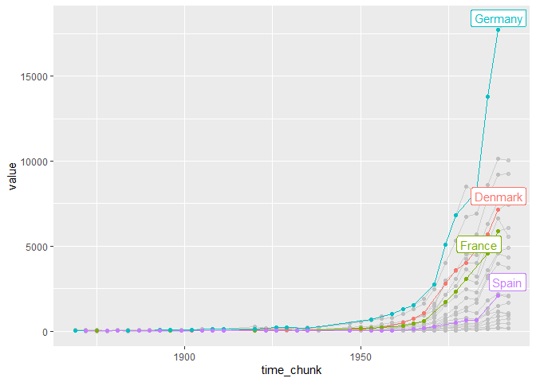<!-- -->

### What about the metrics from AJR and other institutional measures

AJR - Constraint on Executive - Protection for capital - Urbanization

-   Type of regime
-   Legislative index
-   Party legitimacy
-   Legislative effectiveness
-   Type of head of state
-   Legislative effectiveness

``` r
df %>%
  filter(variable %in% c("Constraint on Executive", "Protection for Capital"),
         !is.na(value)) %>%
  pivot_wider(names_from = variable) %>% 
  filter(year == 1800) %>% 
  ggplot(aes(`Constraint on Executive`, `Protection for Capital`, label = country)) +
  geom_jitter() +
  geom_text()
```

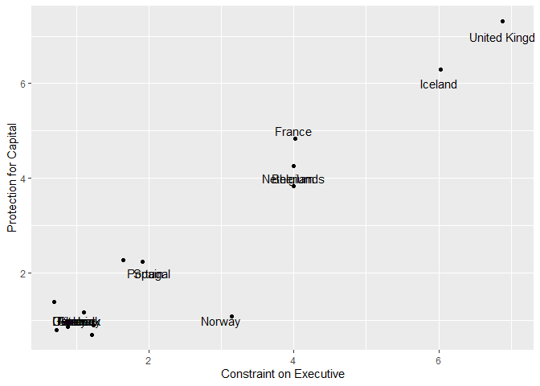<!-- -->

``` r
df %>% 
  filter(variable == "Legislative effectiveness") %>% filter(!is.na(value)) %>% 
  ggplot(aes(value, fill = factor(year))) +
  geom_density()
```

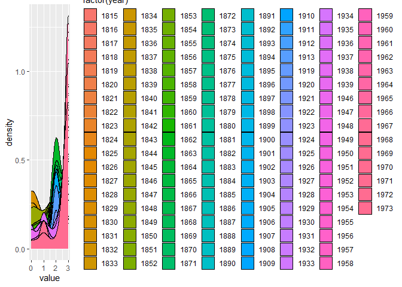<!-- -->

``` r
df %>%
    filter(variable %in% c("Constraint on Executive", "Protection for capital", "Population")) %>%
    pivot_wider(names_from = variable) %>%
    rowwise() %>%
    mutate(across(-c(year, country, Population), .fns = ~ .x / Population)) %>% arrange(desc(year))
```

    ## # A tibble: 4,922 x 4
    ## # Rowwise: 
    ##     year country   Population `Constraint on Executive`
    ##    <int> <chr>          <dbl>                     <dbl>
    ##  1  2001 Australia         NA                        NA
    ##  2  2001 Austria           NA                        NA
    ##  3  2001 Belgium           NA                        NA
    ##  4  2001 Canada            NA                        NA
    ##  5  2001 Denmark           NA                        NA
    ##  6  2001 Finland           NA                        NA
    ##  7  2001 France            NA                        NA
    ##  8  2001 Germany           NA                        NA
    ##  9  2001 Greece            NA                        NA
    ## 10  2001 Iceland           NA                        NA
    ## # ... with 4,912 more rows

### What about doing t-SNE or UMAP on the different technologies and then doing a dot plot by country and year

``` r
df
```

    ## # A tibble: 398,272 x 4
    ##    variable    year country   value
    ##    <chr>      <int> <chr>     <dbl>
    ##  1 Population  1788 Australia    NA
    ##  2 Population  1788 Austria      NA
    ##  3 Population  1788 Belgium      NA
    ##  4 Population  1788 Canada       NA
    ##  5 Population  1788 Denmark      NA
    ##  6 Population  1788 Finland      NA
    ##  7 Population  1788 France       NA
    ##  8 Population  1788 Germany      NA
    ##  9 Population  1788 Greece       NA
    ## 10 Population  1788 Iceland      NA
    ## # ... with 398,262 more rows

### What about the correlations?

``` r
df_mod <- df %>% 
  filter(variable %in% c("year",
                         "Real GDP",
                         "Population",
                         "Energy output",
                         "Literacy rate",
                         "Primary Enrollment",
                         "Secondary Enrollment",
                         "Private Cars",
                         "Commercial Cars",
                         "Aviation - PKM",
                         "Aviation-TKM",
                         "Length of Railway line open",
                         "Freight traffic on railways-1",
                         "Passenger traffic on railways-1",
                         "Number of Ships-All",
                         "Tonnage-Motorships",
                         "Mail",
                         "Phones",
                         "Personal Computers",
                         "Mobile Phones",
                         "Telegraph",
                         "Radios",
                         "Newspapers",
                         "Imports - 1",
                         "Exports - 1",
                         "industrial robots",
                         "steel total"))

df_mod <- df_mod %>% 
  filter(!is.na(value)) %>% 
  distinct(.keep_all = T) %>% 
  pivot_wider(names_from = variable, values_from = value, values_fill = 0) %>% 
  janitor::clean_names()
```

### Correlations

First we have the raw correlations - these are simply how the variables
are correlated with each other.

What we can see are maybe 3 clusters.

You’ve got a nice strong correlation between energy output, and
transportation like aviation and cars. In that mix are also some
communication technologies like Phones and Mail.

Then on the bottom section are railways, newspapers, radios, ships and
telegraphs. Similar technologies but from the previous era.

Then obviously literacy, schooling are correlated. Imports and exports.
I think it is just a time trend that links imports and secondary
education.

Next I want to do a regression controlling for year, grab the residuals,
and then do the same correlations.

``` r
library(tidymodels)
```

    ## Registered S3 method overwritten by 'tune':
    ##   method                   from   
    ##   required_pkgs.model_spec parsnip

    ## -- Attaching packages -------------------------------------- tidymodels 0.1.4 --

    ## v broom        0.7.9      v rsample      0.1.0 
    ## v dials        0.0.10     v tune         0.1.6 
    ## v infer        1.0.0      v workflows    0.2.3 
    ## v modeldata    0.1.1      v workflowsets 0.1.0 
    ## v parsnip      0.1.7      v yardstick    0.0.8 
    ## v recipes      0.1.17

    ## -- Conflicts ----------------------------------------- tidymodels_conflicts() --
    ## x scales::discard() masks purrr::discard()
    ## x dplyr::filter()   masks stats::filter()
    ## x recipes::fixed()  masks stringr::fixed()
    ## x dplyr::lag()      masks stats::lag()
    ## x yardstick::spec() masks readr::spec()
    ## x recipes::step()   masks stats::step()
    ## * Use suppressPackageStartupMessages() to eliminate package startup messages

``` r
tidy_rec <- recipe(real_gdp ~ ., data = df_mod) %>% 
  update_role(c(year, country), new_role = "id") %>% 
  step_log(real_gdp, offset = 1) %>% 
  step_normalize(all_numeric_predictors())
  
df_juiced <- tidy_rec %>% prep() %>% juice()

library(corrr)

corrs <- df_juiced %>% 
  select(-c(year, country)) %>%
  correlate() %>% 
  rearrange()
```

    ## 
    ## Correlation method: 'pearson'
    ## Missing treated using: 'pairwise.complete.obs'

``` r
corrs
```

    ## # A tibble: 25 x 26
    ##    term    private_cars energy_output commercial_cars   mail phones aviation_pkm
    ##    <chr>          <dbl>         <dbl>           <dbl>  <dbl>  <dbl>        <dbl>
    ##  1 privat~       NA             0.943           0.842  0.867  0.904        0.811
    ##  2 energy~        0.943        NA               0.812  0.797  0.943        0.801
    ##  3 commer~        0.842         0.812          NA      0.954  0.742        0.965
    ##  4 mail           0.867         0.797           0.954 NA      0.733        0.915
    ##  5 phones         0.904         0.943           0.742  0.733 NA            0.728
    ##  6 aviati~        0.811         0.801           0.965  0.915  0.728       NA    
    ##  7 aviati~        0.729         0.709           0.784  0.786  0.663        0.842
    ##  8 popula~        0.804         0.768           0.679  0.765  0.756        0.593
    ##  9 freigh~        0.643         0.536           0.637  0.763  0.500        0.535
    ## 10 steel_~        0.551         0.562           0.386  0.409  0.610        0.316
    ## # ... with 15 more rows, and 19 more variables: aviation_tkm <dbl>,
    ## #   population <dbl>, freight_traffic_on_railways_1 <dbl>, steel_total <dbl>,
    ## #   length_of_railway_line_open <dbl>, newspapers <dbl>, radios <dbl>,
    ## #   industrial_robots <dbl>, mobile_phones <dbl>, telegraph <dbl>,
    ## #   real_gdp <dbl>, passenger_traffic_on_railways_1 <dbl>,
    ## #   number_of_ships_all <dbl>, exports_1 <dbl>, imports_1 <dbl>,
    ## #   secondary_enrollment <dbl>, tonnage_motorships <dbl>, ...

``` r
set.seed(2021)

corrs %>% 
  network_plot(colours = c("orange", "grey80", "midnightblue"))
```

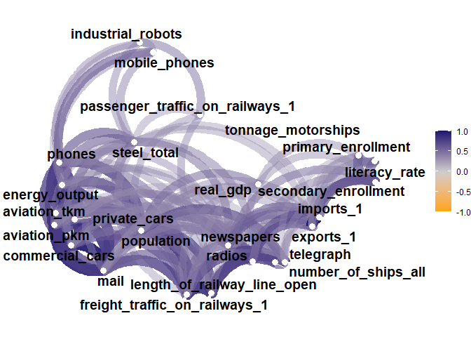<!-- -->

### Recipe for controlling for a time trend

Splits:

``` r
split <- initial_split(df_mod, strata = year)

set.seed(2021)
df_train <- training(split)
df_test <- testing(split)
df_folds <- vfold_cv(df_train)
```

``` r
lasso_rec <- recipe(real_gdp ~ ., data = df_mod) %>% 
  update_role(c(country), new_role = "id") %>% 
  step_log(real_gdp, offset = 1) %>% 
  step_normalize(all_numeric_predictors(), -year)

lasso_juiced <- lasso_rec %>% prep() %>% juice()

lasso_spec <- linear_reg(penalty = tune(), mixture = 1) %>% 
  set_mode("regression") %>% 
  set_engine("glmnet") 

lasso_workflow <- 
  workflow() %>% 
  add_recipe(lasso_rec) %>% 
  add_model(lasso_spec) 

lasso_grid <- tidyr::crossing(penalty = 10^seq(-6, -1, length.out = 20)) 

lasso_tune <- 
  tune_grid(lasso_workflow, resamples = df_folds, grid = lasso_grid) 

lasso_tune %>% autoplot()
```

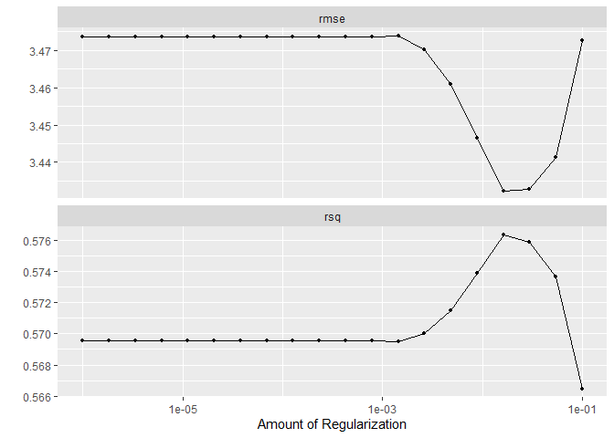<!-- -->

``` r
lasso_best <- lasso_tune %>% select_best(., "rsq")

lasso_final_wf <- finalize_workflow(lasso_workflow, lasso_best)

lasso_final_fit <- last_fit(lasso_final_wf, split = split)
```

What does it look like?

``` r
extract_fit_parsnip(lasso_final_fit) %>% tidy() %>% 
  filter(term != "(Intercept)") %>% 
  slice_max(abs(estimate), n = 20) %>% 
  mutate(term = fct_reorder(term, estimate)) %>% 
  ggplot(aes(estimate, term, fill = estimate > 0)) +
  geom_col()
```

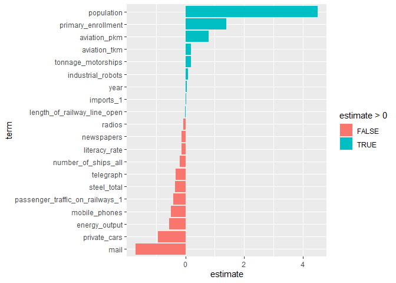<!-- -->

``` r
lm(real_gdp ~ ., data = lasso_juiced %>% select(!country)) %>% 
  tidy() %>% 
  filter(term != "(Intercept)") %>% 
  slice_max(abs(estimate), n = 20) %>% 
  mutate(term = fct_reorder(term, estimate)) %>% 
  ggplot(aes(estimate, term, fill = estimate > 0)) +
  geom_col()
```

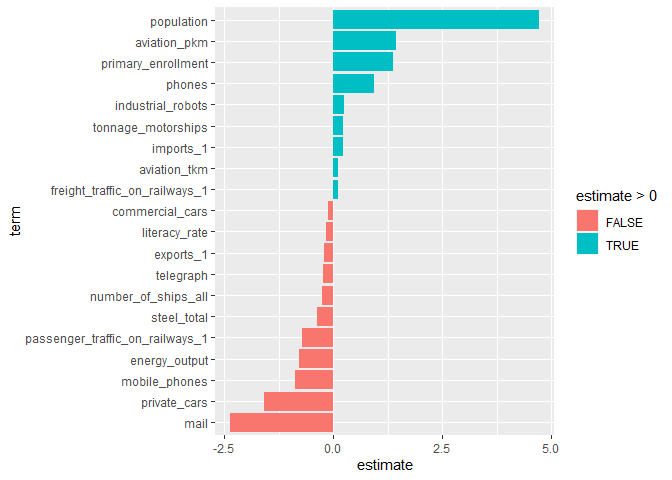<!-- -->
